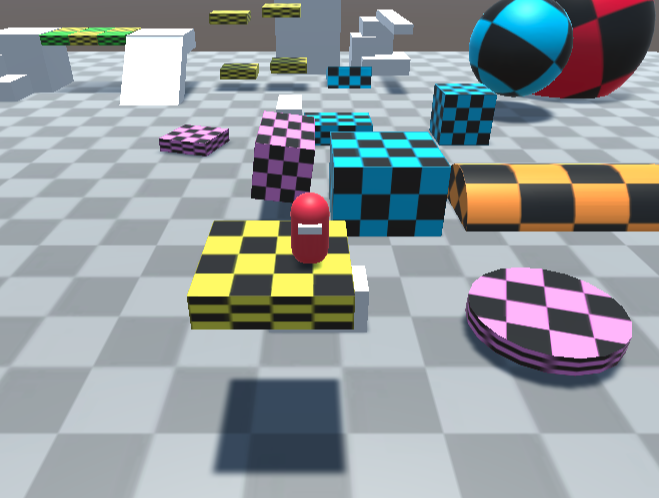

# Moving Platform

Unityのアクションゲームにおける移動・回転・伸び縮みする床に対応し、一緒に移動するスクリプトを考えました。

本リポジトリはそのサンプルプロジェクトです。

[こちら](https://hakumairise.github.io/)からブラウザ上でサンプルシーンをプレイできます。(WASDで移動、スペースでジャンプ)

詳しい使い方・プログラムの説明は[こちら](https://hakumairise.hatenablog.com/entry/2023/03/24/210530?_ga=2.244770757.1508749366.1679489076-1527217744.1679292285)

・Windows 11

・Unity 2021.3.8f1　で実行しました。

## ライセンス
本リポジトリはMITライセンスで提供されています。
